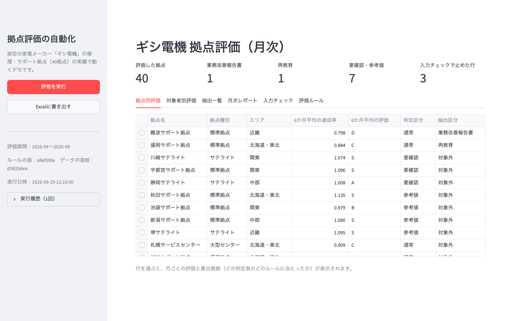
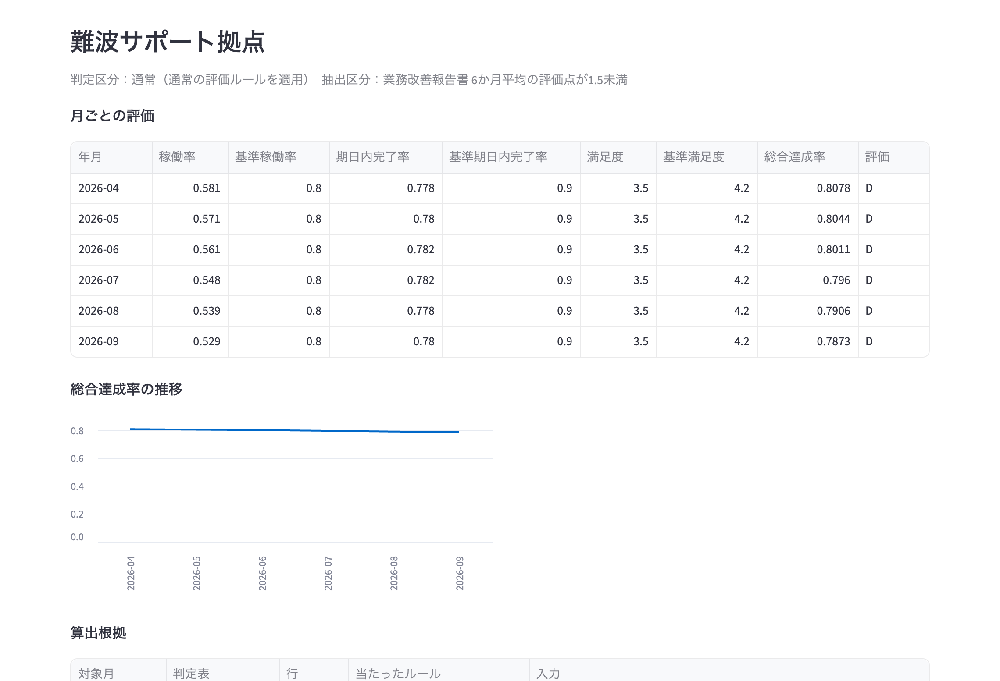
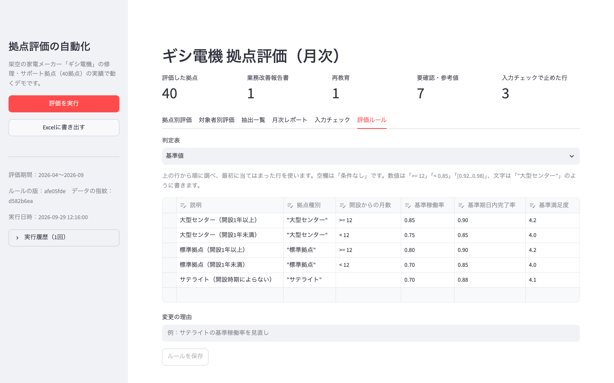
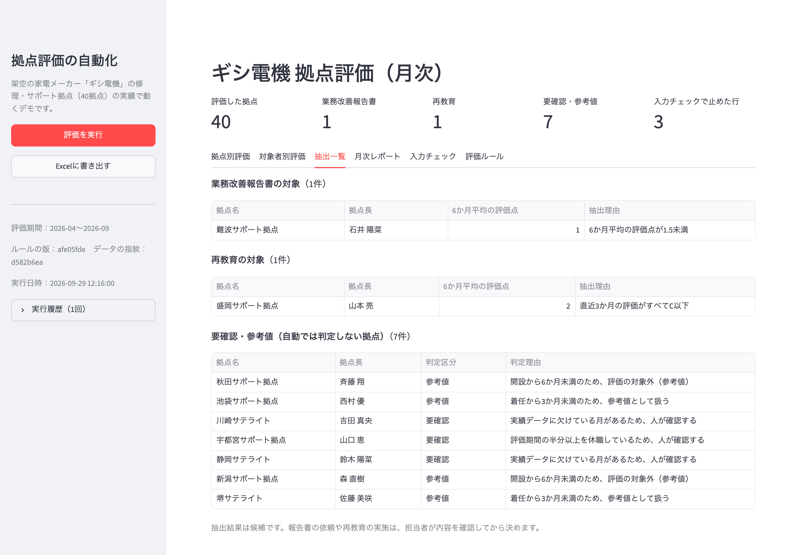
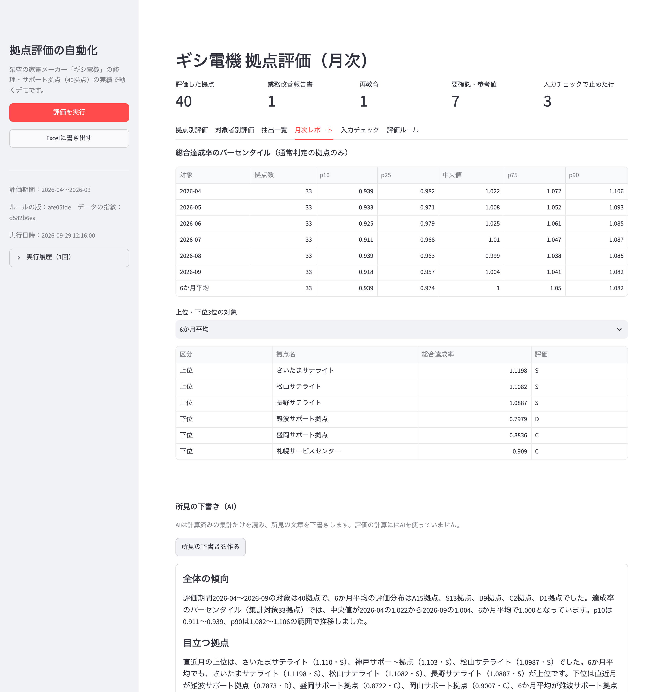
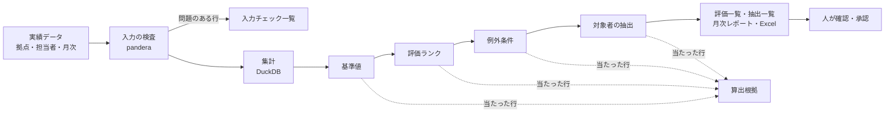

# 評価・判定ルールの自動化（拠点評価デモ）

多拠点の実績データを集計し、**基準値・例外条件などのルールに沿って評価を算出し、対象者を抽出する**仕組みのデモです。
ルールは担当者が画面の表で直せ、すべての評価に「どのルールのどの条件で算出したか」という根拠が残ります。

> 題材は架空の家電メーカー「ギシ電機」の修理・サポート拠点（40拠点・6か月分）です。拠点・人物・数値はすべてデモ用に作成したもので、実在のものとは関係ありません。



| 算出根拠 | 担当者が直せる評価ルール |
|---|---|
|  |  |
| **抽出一覧** | **月次レポート** |
|  |  |

## 解決したいこと

拠点や担当者の評価を、手作業の集計と照合で行っていると、次のことが起きがちです。

- 複数のデータを集めて整え、基準値と照らし合わせる作業に、毎月長い時間がかかる。
- 拠点の種別や開設時期で基準が変わり、着任・休職などの例外もあるため、判定を間違えやすい。
- ルールを知っている人にしかできず、担当が変わると回らない。
- 賞与や昇降格に使うのに、「なぜこの評価になったのか」を説明しにくい。

## 特徴

1. **評価の計算にAIを使わない**
   基準値の照合も例外の判定も、判定表（ルール）で決めています。同じデータと同じルールなら、何度計算しても同じ結果になります。
2. **ルールは担当者が画面で直せる**
   基準値・評価ランク・例外条件・抽出条件を、表として編集できます。保存には変更の理由が必要で、変更前の版は履歴に残ります。式の書き方が誤っていれば、何行目のどの欄かを示して保存を止めます。
3. **すべての評価に算出根拠が残る**
   「どの判定表の何行目に、どの値で当たったか」を、拠点ごと・月ごとに記録します。評価結果には、使ったルールの版と入力データの指紋も記録します。
4. **例外は人に回す**
   開設直後・着任直後の拠点は「参考値」、データの欠けや長期の休職がある拠点は「要確認」とし、自動では評価を確定しません。
5. **入力データを評価の前に検査する**
   マイナスの件数、存在しない拠点ID、件数の食い違いなどを見つけ、その行は評価に使いません。
6. **月次レポートまで作る**
   パーセンタイル、毎月と6か月平均の上位・下位3位、抽出一覧を表示し、根拠を含めてExcelに書き出せます。所見の文章だけはAI（Claude）が下書きします。AIには計算済みの集計だけを渡し、数値の新たな計算や人事判断の記述をしないよう指示しています。

## 仕組み



判定表は [ZEN Engine](https://github.com/gorules/zen)（業務ルールエンジン）で評価し、GoRules の標準形式（JDM）で `rules/` に保存しています。

## 判定表

| 判定表 | 条件 | 結果 |
|---|---|---|
| 基準値 | 拠点種別、開設からの月数 | 基準稼働率、基準期日内完了率、基準満足度 |
| 評価ランク | 総合達成率 | 評価（S〜D）、評価点 |
| 例外条件 | 開設からの月数、実績が欠けている月数、休職の割合、着任からの月数 | 判定区分（通常・参考値・要確認）、理由 |
| 対象者の抽出 | 判定区分、6か月平均の評価点、直近3か月の最高評価点 | 抽出区分（業務改善報告書・再教育・対象外）、理由 |

どの表も上の行から順に調べ、最初に当てはまった行を使います。

総合達成率は、稼働率・期日内完了率・満足度のそれぞれについて「実績 ÷ 基準」を求め、その平均としています。1つの指標だけが突出して他の不足を打ち消さないよう、各指標の比は1.2を上限にしています。

エリアマネージャーは、担当エリアで「通常」と判定された拠点の6か月平均から評価します。

## 動かし方

Python 3.10以降が必要です。

```bash
git clone https://github.com/gishi-dev/rule-evaluation.git
cd rule-evaluation
python3 -m venv .venv
source .venv/bin/activate
pip install -r requirements.txt
streamlit run app.py
```

評価の計算には、APIキーは必要ありません。所見の下書きを使う場合だけ、`.env.example` を `.env` にコピーして `ANTHROPIC_API_KEY` を設定します。

## ファイル構成

| ファイル | 役割 |
|---|---|
| `app.py` | 画面（拠点別評価、対象者別評価、抽出一覧、月次レポート、入力チェック、評価ルール） |
| `evalkit/data.py` | 入力データの読み込みと検査 |
| `evalkit/rules.py` | 判定表の読み書き・検査・評価、版と変更履歴 |
| `evalkit/engine.py` | 集計と評価の計算、パーセンタイル、上位・下位 |
| `evalkit/report.py` | Excelの書き出し |
| `evalkit/ai.py` | 所見の下書き（Claude API） |
| `rules/` | 判定表（基準値・評価ランク・例外条件・対象者の抽出） |
| `sample/` | 架空の実績データ（拠点40、担当者45、月次6か月分） |

## 実際の業務で使うには

- **データ**：`sample/` の3つのCSVを、自社の実績データに置き換えます。基幹システムやスプレッドシートから取り込む場合は、この形に整える処理を足します。
- **ルール**：評価の指標、基準値、例外の条件、抽出の条件を、自社の評価制度に合わせて判定表に書きます。
- **運用**：人事評価に使う場合は、画面の利用者と権限、評価結果の承認の流れ、公開前の確認手順もあわせて設計します。

## 使っているOSS

- [ZEN Engine](https://github.com/gorules/zen)（MIT）：判定表の評価
- [pandera](https://github.com/unionai-oss/pandera)（MIT）：入力データの検査
- [DuckDB](https://github.com/duckdb/duckdb)（MIT）：集計とパーセンタイル
- [Streamlit](https://github.com/streamlit/streamlit)（Apache-2.0）：画面

## ライセンス

[MIT License](LICENSE)
